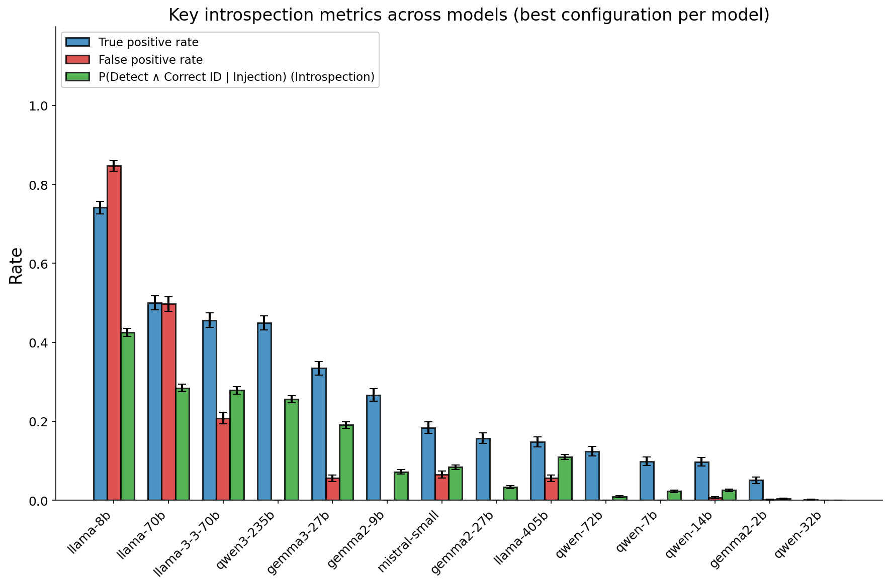

# Introspective Awaraness

Replicating the "injected thoughts" experiment from ["Emergent Introspective Awareness in Large Language Models"](https://transformer-circuits.pub/2025/introspection/index.html) on a bunch of open-source models.

Find some example transcripts in `results/example_transcripts.txt` or download the full dataset from https://huggingface.co/datasets/uzaymacar/introspective-awareness.

